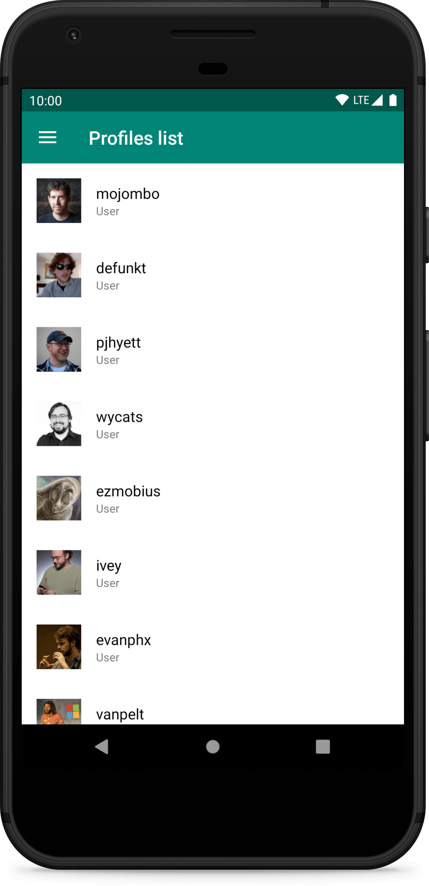
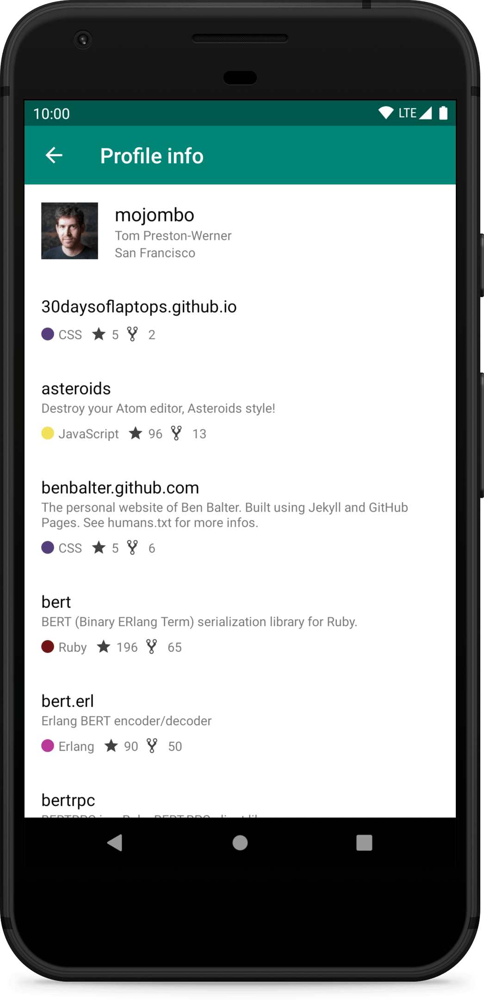
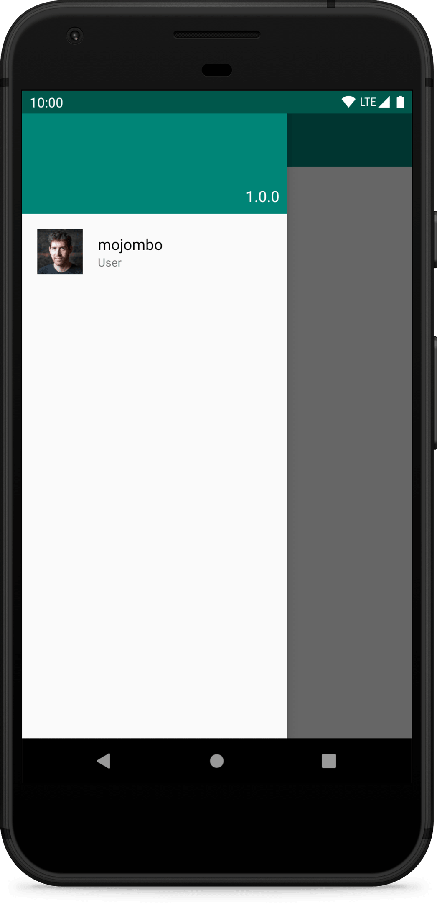

# Android GitHub Client

[](https://github.com/fartem/android-github-client/actions?query=workflow%3ABuild)
[](https://codebeat.co/projects/github-com-fartem-android-github-client-master)
[](https://codecov.io/gh/fartem/android-github-client)

## About

Demo app for exploring GitHub accounts and browse users repositories.

## Languages colors

Provided by [github-colors](https://github.com/fartem/github-colors).

## Screenshots

<p align="center">
  
  
  
</p>

## Download


## How to contribute

Read [Commit Convention](https://github.com/fartem/repository-rules/blob/master/commit-convention/COMMIT_CONVENTION.md). Make sure your build is green before you contribute your pull request. Then:

```shell
$ ./gradlew clean
$ ./gradlew build
```

If you don't see any error messages, submit your pull request.

## Contributors

* [@fartem](https://github.com/fartem) as Artem Fomchenkov
